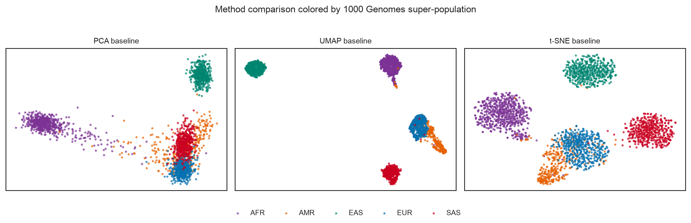

# GENUMAP

**A reproducible study of UMAP behavior on human genetic variation data.**

GENUMAP asks a focused methodological question: how strongly do preprocessing,
parameter choices, and random initialization affect the apparent structure of
human genetic diversity in two-dimensional UMAP visualizations?

This is a new standalone study inspired by a 2024 summer research project. It is
an unofficial, independent project and is not an official publication or release
of Harvard University, Harvard T.H. Chan School of Public Health, Dana-Farber
Cancer Institute, rafalab, or the original investigators.

## Study design

The empirical workflow uses the public 1000 Genomes Project Phase 3 chromosome
22 call set (2,504 samples from 26 populations). It:

1. selects common, biallelic SNPs with low missingness and physical spacing;
2. mean-imputes and standardizes genotype dosages;
3. computes PCA representations;
4. evaluates UMAP across input dimensions, neighborhood sizes, minimum
   distances, and random seeds;
5. compares a prespecified PCA, UMAP, and t-SNE baseline; and
6. quantifies neighborhood preservation, trustworthiness, distance
   preservation, group separation, and seed stability.

Population and super-population labels describe 1000 Genomes sampling groups.
They are not interchangeable with race, ethnicity, or discrete biological types.

## Run

Install [`uv`](https://docs.astral.sh/uv/), then:

```bash
uv sync --frozen
uv run genumap check --config configs/study.yaml
uv run genumap run --config configs/study.yaml
```

The full run downloads approximately 206 MB of public source data on first use.
Generated data and artifacts are ignored by Git. To verify the pipeline quickly
without downloading human genomic data:

```bash
uv run genumap run --config configs/study.yaml --synthetic --quick
```

Outputs are written to `artifacts/<run-id>/` with the resolved configuration,
input hashes, metrics, embeddings, figures, result summary, and run manifest.

## Main result

The complete prespecified run finished on 2,504 samples and 2,500 chromosome 22
SNPs. Across 108 UMAP fits, trustworthiness ranged from 0.920 to 0.980, k-nearest
neighbor overlap from 0.126 to 0.409, and seed disparity from 0.014 to 0.456.
UMAP increased the apparent separation of broad super-populations relative to
two-dimensional PCA while preserving global pairwise distances much less well.
All population-level silhouette scores remained negative, and projected outlier
persistence was low.



The bounded conclusion is methodological: recognizable genetic structure is
present, but the gaps, compactness, global arrangement, and apparent outliers in
a two-dimensional UMAP are not invariant properties of the data.

## Documentation

- [Study design](docs/study_design.md)
- [Reproducibility](docs/reproducibility.md)
- [Data handling](docs/data_handling.md)
- [Architecture](docs/architecture.md)
- [Project background](docs/project_background.md)
- [Unofficial manuscript](paper/manuscript.md)

## Result snapshot

The reviewed full-run figures, metrics, and provenance manifest are stored under
[`paper/`](paper/). Generated participant-level embeddings remain ignored by Git.

## License

Code and documentation are released under the [MIT License](LICENSE). Upstream
datasets retain their own terms and citation requirements and are not
redistributed by this repository.
