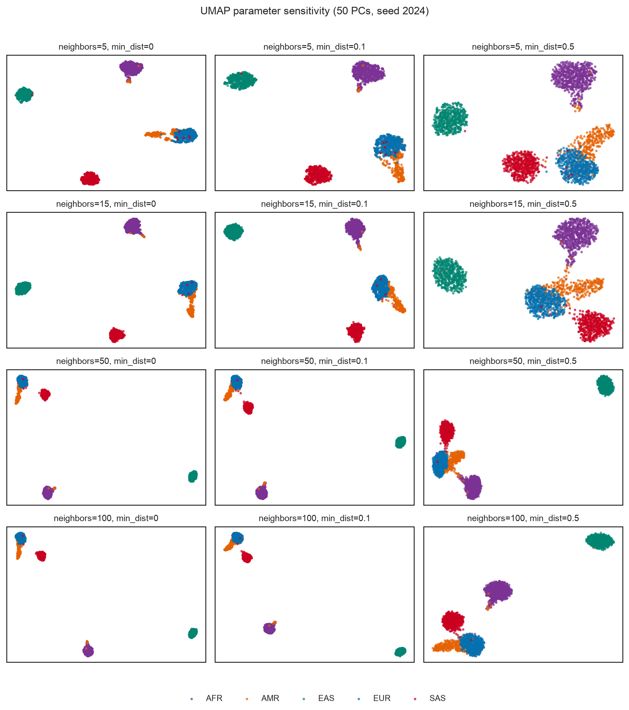
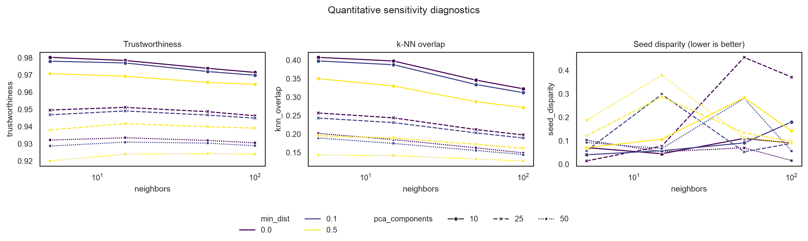

# Parameter Sensitivity and Stability of UMAP Visualizations of Human Genetic Variation

**Mohammed Khodor Firas Al-Tal**  
Independent retrospective study, 2026

> **Unofficial independent study.** This manuscript documents a new retrospective
> research project inspired by, but not reproducing, a 2024 summer REU. It is not
> an official release or publication of the institutions or investigators involved
> in that earlier project.

## Abstract

Uniform Manifold Approximation and Projection (UMAP) is widely used to visualize
high-dimensional biological data, but its two-dimensional output depends on the
input representation, hyperparameters, and stochastic optimization. We evaluate
these dependencies using common variation from the 1000 Genomes Project Phase 3
chromosome 22 call set. The prespecified study varies PCA input dimension, UMAP
neighborhood size, minimum distance, and random seed; compares representative PCA,
UMAP, and t-SNE views; and quantifies neighborhood preservation, trustworthiness,
distance preservation, outlier persistence, group separation, and seed stability.
Across 108 UMAP fits, local trustworthiness ranged from 0.920 to 0.980, sampled
global distance correlation from 0.441 to 0.823, and Procrustes seed disparity
from 0.014 to 0.456. UMAP generally made broad super-population separation more
visually pronounced than two-dimensional PCA while population-level silhouette
scores remained negative. These results show that recognizable genetic structure
coexists with substantial projection-dependent geometry.

## Background and motivation

Low-dimensional genomic visualizations are compelling because they turn subtle
patterns across many variants into visible geometry. That geometry is not a
literal map of human groups. UMAP emphasizes local neighborhoods through a
nonlinear and stochastic optimization, and different defensible analysis choices
can alter apparent gaps, overlaps, density, and outliers.

GENUMAP revisits the methodological question as a new study rather than attempting
to reproduce an incomplete 2024 analysis. The goal is to measure what remains
stable, what changes, and which visual impressions are weakly supported by the
high-dimensional input.

## Related work

UMAP was introduced as a nonlinear method grounded in a fuzzy topological
representation of local neighborhoods. Like t-SNE, it is frequently used as a
two-dimensional biological visualization even though display-space distances and
density are not direct estimates of high-dimensional geometry. The 2024 All of Us
genomics resource included UMAP views of PCA-derived genomic representations
colored by self-described race, ethnicity, and inferred ancestry. GENUMAP does not
use All of Us data or reproduce that figure; it studies the narrower algorithmic
sensitivity question on a public reference panel.

## Data

The study uses the public 1000 Genomes Project Phase 3 chromosome 22 call set and
its accompanying population panel. The release contains 2,504 samples from 26
populations grouped into five super-populations. These labels describe the study's
sampling framework and are not treated as race or as discrete biological types.

## Methods

We retain passing biallelic SNPs with minor allele frequency at least 0.05 and
missingness no greater than 0.02. Eligible variants are separated by at least
10 kb, after which deterministic reservoir sampling retains at most 2,500 SNPs.
Missing dosages are mean-imputed, centered at twice the allele frequency, and
scaled by the binomial standard deviation.

PCA is computed once with a fixed seed. UMAP is evaluated using 10, 25, and 50
principal components; neighborhood sizes 5, 15, 50, and 100; minimum distances
0.0, 0.1, and 0.5; and random seeds 2024, 2025, and 2026. Representative PCA and
t-SNE embeddings provide visual references.

Embedding fidelity is assessed with trustworthiness, k-nearest-neighbor overlap,
and sampled pairwise-distance Spearman correlation. Procrustes disparity measures
seed stability. Silhouette scores are reported only as descriptive label-based
summaries. Outlier persistence compares within-population distance outliers in
input and display space.

## Results

### Analysis set

The configured filters and deterministic sampling retained 2,500 SNPs for all
2,504 samples. The first two PCs explained 14.43% of standardized genotype
variance; 10, 25, and 50 PCs explained 20.47%, 25.81%, and 32.02%, respectively.

### Method comparison

For the prespecified 50-PC reference views, two-dimensional PCA preserved sampled
global distances most strongly (Spearman 0.915) but had low 15-neighbor overlap
(0.049). The baseline UMAP had trustworthiness 0.931, neighbor overlap 0.172, and
global distance correlation 0.576. t-SNE had trustworthiness 0.955, neighbor
overlap 0.277, and global correlation 0.662.

The baseline super-population silhouette increased from 0.532 for PCA to 0.682
for UMAP, even though the population-level silhouette remained negative for both
(-0.132 and -0.089). Thus UMAP made broad labels appear more separated without
producing coherent separation among the 26 sampled populations.

### UMAP sensitivity

Across all 108 UMAP fits, trustworthiness ranged from 0.920 to 0.980 (median
0.947), neighbor overlap from 0.126 to 0.409 (median 0.202), and sampled global
distance correlation from 0.441 to 0.823 (median 0.587). The 10-PC inputs had
higher mean trustworthiness and neighbor overlap than 25- or 50-PC inputs, partly
because preserving neighborhoods from a lower-dimensional reference is an easier
problem and should not be interpreted as evidence that 10 PCs contain more of the
original genotype structure.

Increasing `n_neighbors` from 5 to 100 reduced mean neighbor overlap from 0.265
to 0.209 and mean global distance correlation from 0.635 to 0.572, while mean
super-population silhouette increased from 0.630 to 0.684. Reducing `min_dist`
from 0.5 to 0 increased mean super-population silhouette from 0.606 to 0.703.
These settings therefore altered both fidelity and the apparent strength of
broad-group separation.

### Seed stability and outliers

Procrustes disparity across seeds ranged from 0.014 to 0.456 across parameter
settings. Some configurations retained similar local metrics while placing major
groups in substantially different global arrangements. The Jaccard overlap
between within-population input-space and UMAP-space outliers was low throughout
(0.059 to 0.200; median 0.115), indicating that apparent two-dimensional outliers
were rarely stable high-dimensional outliers under this definition.

## Discussion

The broad relationships visible in the embeddings are not wholly algorithmic:
PCA, UMAP, and t-SNE each recover recognizable structure from the same genotypes.
However, UMAP changes its compactness, gaps, overlap, and global arrangement under
defensible parameter and seed choices. It also increases broad-label silhouette
while sacrificing much of PCA's global distance preservation.

The most defensible reading is therefore neither that the visualization is
meaningless nor that its clusters are literal biological partitions. UMAP is a
useful local-structure display whose strongest visual features require sensitivity
analysis. A single embedding cannot support conclusions about discrete human
groups, and isolated points in the display should not be called genomic outliers
without confirmation in the input space.

## Limitations

The first study uses one autosome and physical spacing rather than formal
population-aware LD pruning. UMAP fidelity metrics capture selected geometric
properties and cannot establish biological meaning. Sampling labels reflect the
1000 Genomes design and do not span the continuous, historically structured nature
of human genetic variation. Metric comparisons across 10-, 25-, and 50-PC inputs
also refer to different reference spaces. The study evaluates visualization
behavior, not ancestry inference, classification accuracy, or trait differences.

## Reproducibility

The complete configuration, locked Python environment, input hashes, metrics,
embeddings, figures, and provenance manifest are generated by one terminal command.
The reviewed aggregate metrics and manifest for the full run are included in
`paper/results/`; participant-level embeddings and cached genotypes are excluded.

## Future work

A direct extension would repeat the prespecified analysis on a genome-wide,
population-aware LD-pruned panel and test whether the chromosome 22 sensitivity
patterns persist. That extension is outside the present bounded study and should
be treated as a new registered configuration rather than folded into these results.

## References

1. The 1000 Genomes Project Consortium. A global reference for human genetic
   variation. *Nature* 526, 68–74 (2015).
2. McInnes L, Healy J, Melville J. UMAP: Uniform Manifold Approximation and
   Projection for Dimension Reduction. arXiv:1802.03426 (2018).
3. van der Maaten L, Hinton G. Visualizing Data using t-SNE. *Journal of Machine
   Learning Research* 9, 2579–2605 (2008).
4. The All of Us Research Program Genomics Investigators. Genomic data in the All
   of Us Research Program. *Nature* 627, 340–346 (2024).
